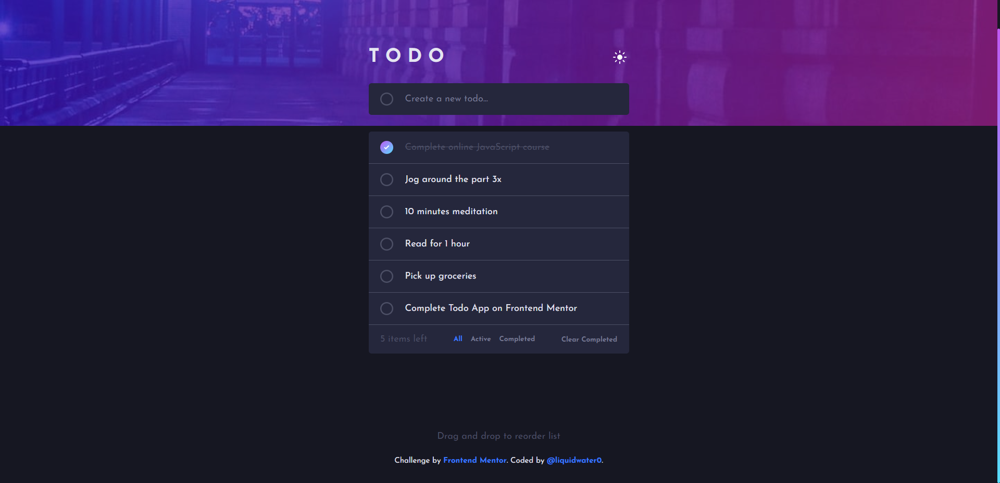

# Frontend Mentor - Todo app solution

This is a solution to the [Todo app challenge on Frontend Mentor](https://www.frontendmentor.io/challenges/todo-app-Su1_KokOW). Frontend Mentor challenges help you improve your coding skills by building realistic projects. 

## Table of contents

- [Overview](#overview)
  - [The challenge](#the-challenge)
  - [Screenshot](#screenshot)
  - [Links](#links)
- [My process](#my-process)
  - [Built with](#built-with)
  - [What I learned](#what-i-learned)
  - [Continued development](#continued-development)
  - [Useful resources](#useful-resources)
- [Author](#author)

## Overview

### The challenge

Users should be able to:

- View the optimal layout for the app depending on their device's screen size
- See hover states for all interactive elements on the page
- Add new todos to the list
- Mark todos as complete
- Delete todos from the list
- Filter by all/active/complete todos
- Clear all completed todos
- Toggle light and dark mode
- **Bonus**: Drag and drop to reorder items on the list

### Screenshot



### Links

- Solution URL: [Add solution URL here](https://your-solution-url.com)
- Live Site URL: [Add live site URL here](https://your-live-site-url.com)

## My process

### Built with

- Semantic HTML5 markup
- CSS custom properties
- Flexbox
- [React](https://reactjs.org/) - JS library
- [Sass](https://sass-lang.com/) - CSS preprocessor

### What I learned

I have never made a drag and drop feature or a feature to move items up and down, so I am proud about this code. (Note: There is a drag end and arrange down function, but I only provide these below as to not have too much code)
I did learn about how to make responsive images using the picture element.

```js
function handleDragOver(event: DragEvent) {
    event.preventDefault();

    setTodos(prevTodos => {
        return prevTodos.map(todo => ({ ...todo, draggedOver: false }));
    });

    setTodos(prevTodos => {
        return prevTodos.map(todo => {
            if (todo.id === id) return { ...todo, draggedOver: true };
            return todo;
        });
    });
}

function handleArrangeUp() {
    const currentTodo = todos.find(todo => todo.id === id);

    if (!currentTodo) return;

    const currentTodoIndex = todos.indexOf(currentTodo);
    const nextTodoIndex = currentTodoIndex - 1;
    const nextTodo = todos[nextTodoIndex];

    if (nextTodoIndex < 0) return;

    setTodos(prevTodos => {
        return prevTodos.map(todo => {
            if (todo.id === currentTodo.id) return nextTodo;
            if (todo.id === nextTodo.id) return currentTodo;
            return todo;
        });
    });
}
```

### Continued development

I want to try and build more apps to test my skills.

### Useful resources

- [Mozilla MDN](https://developer.mozilla.org/en-US/) - This website helped me figure out how to do responsive images.

## Author

- Frontend Mentor - [@liquidwater0](https://www.frontendmentor.io/profile/liquidwater0)